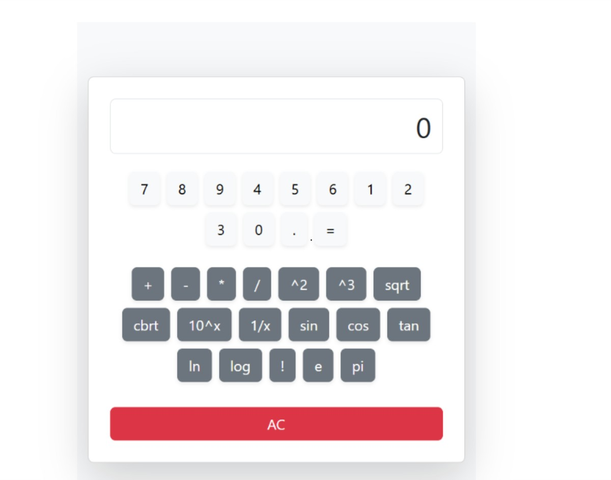

# 🧮 Scientific Calculator (React + Bootstrap)

A stylish and responsive scientific calculator built with **React**, **TypeScript**, and **Bootstrap**. This app performs both basic arithmetic and advanced scientific computations, all from a clean and modern UI.



---

## 🚀 Features

- ✅ Basic arithmetic: `+`, `-`, `×`, `÷`
- 🧪 Scientific functions:
  - Power (`^2`, `^3`, `10^x`)
  - Roots (`√`, `∛`)
  - Trigonometry: `sin`, `cos`, `tan` (in degrees)
  - Logarithms: `ln`, `log₁₀`
  - Inverse: `1/x`
  - Factorial: `n!`
- Constants: `π`, `e`
- Decimal and fractional input support
- Responsive layout using **Bootstrap 5**
- Fully TypeScript-safe

---

## 📦 Tech Stack

- React (Hooks)
- TypeScript
- Bootstrap 5
- Custom CSS (`App.css`)

---

## 🛠️ Getting Started

### 1. Clone the Repository

```bash
git clone https://github.com/your-username/scientific-calculator.git
cd scientific-calculator
